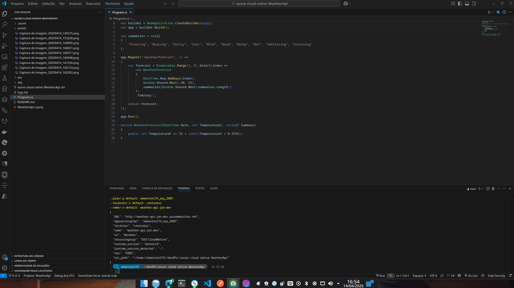
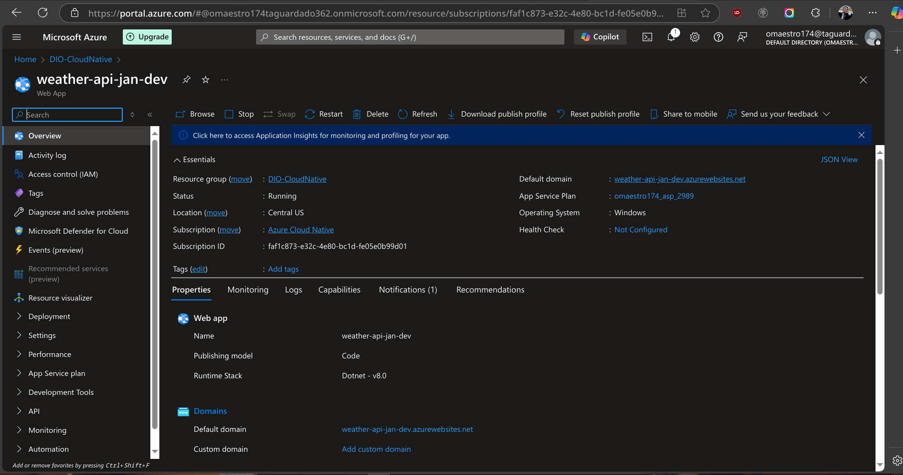
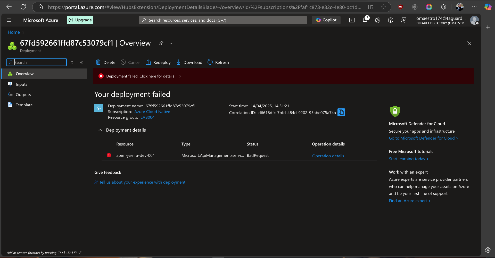
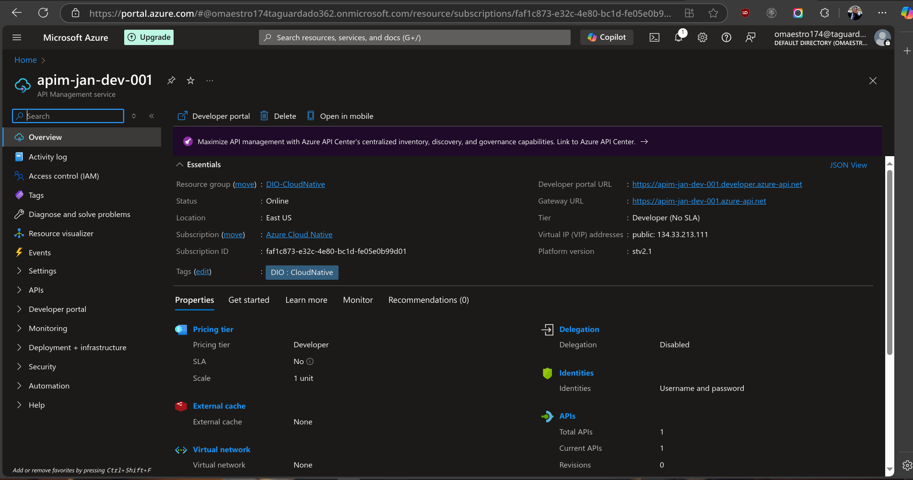
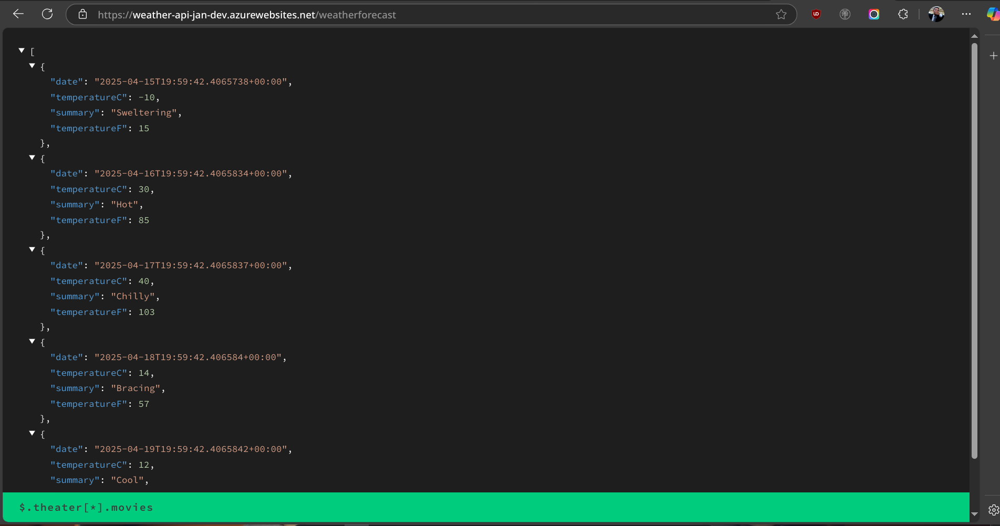
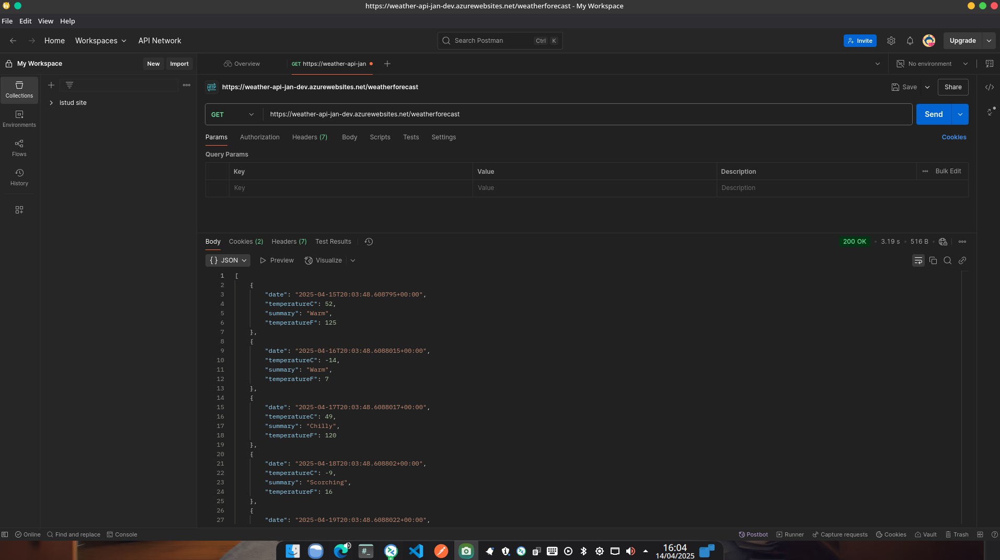
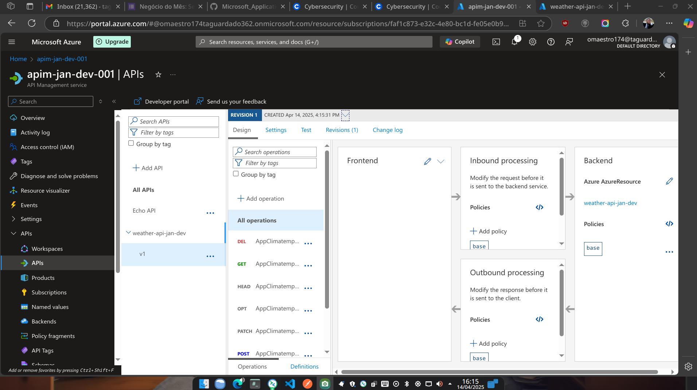
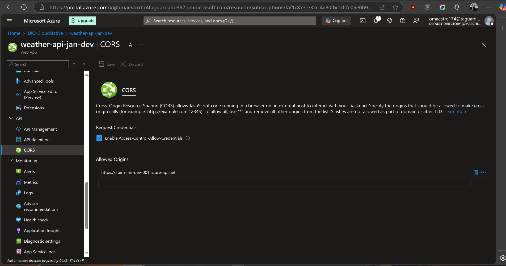
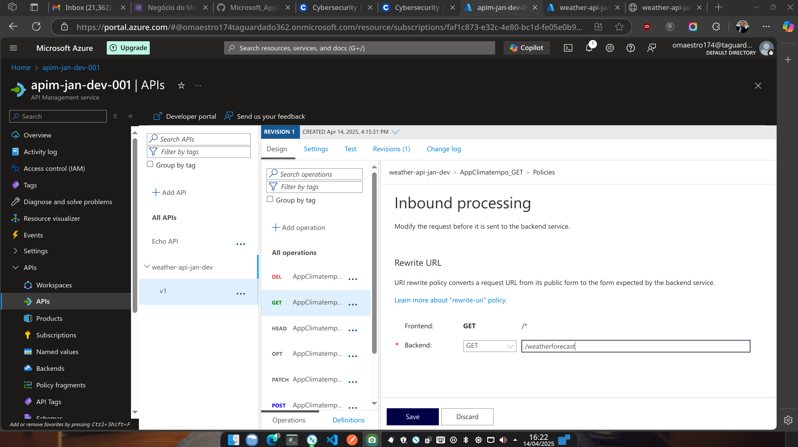
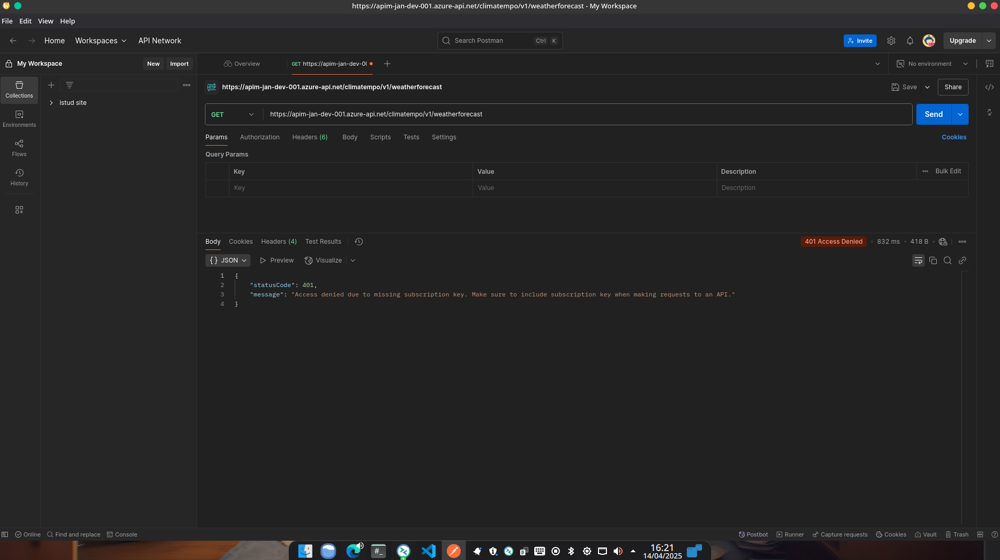

# 🌤️ Weather API no Azure com API Management e Subscription Key

Este projeto demonstra como criar, publicar e proteger uma API REST simples no Azure, usando:
- Azure App Service (Web App)
- Azure API Management (APIM)
- Proteção com chave de subscrição (Subscription Key)

---

## 📦 Tecnologias usadas

- .NET 8 (ASP.NET Core Minimal API)
- Azure App Service (Web App)
- Azure API Management
- Postman para testes

---

## 📁 Estrutura do Projeto

```
WeatherApi/
├── Program.cs
├── WeatherApi.csproj
├── assets/             # Imagens usadas na documentação
│   ├── 01-criando-a-api.png
│   ├── 02-publicacao-da-api.png
│   ├── ...
```

---

## 🚀 Etapas do Projeto

### 1. Criar a API Weather

Criamos uma API de exemplo em .NET 8 com o endpoint:

```
GET /weatherforecast
```

Ela retorna previsões climáticas simuladas.

### 2. Rodar localmente

```bash
dotnet run
```

Acesse [http://localhost:5000/weatherforecast](http://localhost:5000/weatherforecast)

---

### 3. Publicar no Azure Web App

Fizemos deploy da API com:

```bash
az webapp up \
  --name weather-api-jan-dev \
  --resource-group DIO-CloudNative \
  --runtime "dotnet:8" \
  --location centralus
```

🔗 A API ficou disponível em:
```
https://weather-api-jan-dev.azurewebsites.net/weatherforecast
```

---

### 4. Importar a API no API Management

No portal do Azure:

1. Acessamos o recurso **`apim-jan-dev-0001`**
2. Fomos até **APIs > + Add API > Create from Azure resource**
3. Escolhemos a opção **App Service**
4. Selecionamos o Web App `weather-api-jan-dev` e criamos a API diretamente no APIM

---

### 5. Proteger com Subscription Key

Ativamos a proteção da API via **Subscription Key**:

1. No API Management, selecionamos um produto (ex: Starter)
2. Habilitamos **"Require subscription"**
3. Testamos via Postman com o header:

```
Ocp-Apim-Subscription-Key: <sua-chave>
```

---

### ⚠️ Observação

Tentamos implementar autenticação com **JWT via Azure AD**, mas devido a limitações da plataforma no momento e erros ao validar tokens, optamos por utilizar a proteção com **Subscription Key**, que já oferece um controle básico de acesso.

---


## 📸 Telas da aplicação e procedimentos

### Codificação de API



### Publicação da API


### Um pequeno erro,ops!


### Criação do apim concluída


### API acessível publicamente


### Testes da API via Postman


### Alterando e Configurando


### Limitando Acesso via CORS


### Alterando Políticas de Inbound


### Testando as Limitações de Permissões


---


## ✅ Resultado Final

API publicada com sucesso no Azure Web App, integrada ao API Management e protegida com chave de subscrição.

---

## 🙌 Créditos

Este projeto faz parte do treinamento **Azure Cloud Native / DIO** com integração real com App Service + API Management.


---

## 📜 Histórico de comandos CLI utilizados

### 🔑 Login no Azure

```bash
az login
```

### 🚀 Publicação da API no Azure App Service

```bash
az webapp up \
  --name weather-api-jan-dev \
  --resource-group DIO-CloudNative \
  --runtime "dotnet:8" \
  --location centralus
```

> A região `eastus` foi inicialmente tentada, mas estava sem quota disponível para a assinatura. A região `centralus` foi usada com sucesso.

---

### 🧱 Correção de dependências do .NET no Linux (BigLinux/Arch)

Ao tentar rodar o projeto, o erro indicava que o .NET 8 não estava instalado. A instalação foi feita via `pacman`:

```bash
sudo pacman -S dotnet-sdk-8.0 aspnet-runtime-8.0
```

Após isso, os comandos passaram a funcionar normalmente:

```bash
dotnet build
dotnet run
```

---

### 🌐 Testes

A API foi testada via:

- Navegador:  
  [https://weather-api-jan-dev.azurewebsites.net/weatherforecast](https://weather-api-jan-dev.azurewebsites.net/weatherforecast)

- Postman:  
  Com header `Ocp-Apim-Subscription-Key` para validar acesso via APIM

- Teste sem a chave de subscrição:
  [https://apim-jan-dev-001.azure-api.net/climatempo/v1/weatherforecast](https://apim-jan-dev-001.azure-api.net/climatempo/v1/weatherforecast)

---

## 📚 Observações finais

Todo o processo foi realizado com ferramentas CLI e interface gráfica do Azure, documentando eventuais erros e soluções. Essa abordagem reflete um fluxo realista de desenvolvimento e publicação de APIs na nuvem, com foco em aprendizado prático.

## 📝 Logs de Referência
Os logs completos do processo estão disponíveis no arquivo [logs.txt](./logs.txt)